# Endangered Species Agentic GraphRAG QA

**Author:** Mutiara Noor Fauzia — NRP 5026221045

An agentic GraphRAG question-answering system over a Neo4j knowledge graph
of endangered species scraped from the World Wildlife Fund (WWF) website.
The agent uses a ReAct loop driven by a local Ollama LLM and 18
schema-aware parametric Cypher tools, and is evaluated on a generated
ground-truth set of 30 single-hop and multi-hop QA pairs.

The project is organised so each deliverable maps to a clearly named file:

| Deliverable | Path |
|---|---|
| Project overview, install, run, architecture | this `README.md` |
| Architecture diagram (rendered on GitHub) | [`docs/architecture.md`](docs/architecture.md) |
| Cypher + AI pipeline explanation | [`docs/cypher_and_pipeline.md`](docs/cypher_and_pipeline.md) |
| Evaluation methodology + ground truth | [`evaluation/README.md`](evaluation/README.md) |
| Execution screenshots | [`docs/screenshots/`](docs/screenshots/) |
| AI assistance documentation | [`docs/ai_usage.md`](docs/ai_usage.md) |

---

## 1. Architecture at a glance

### System overview

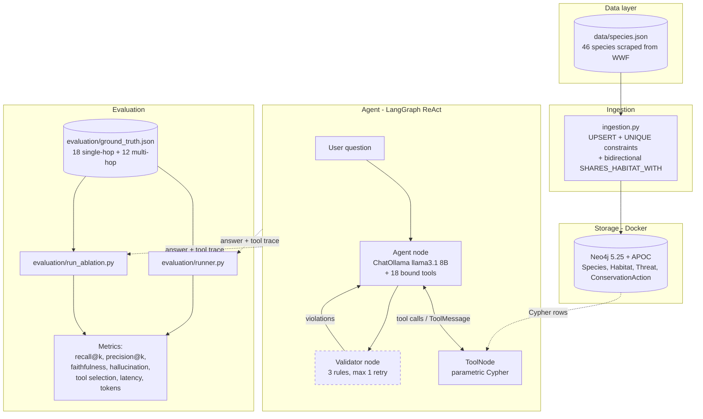

### LangGraph state machine

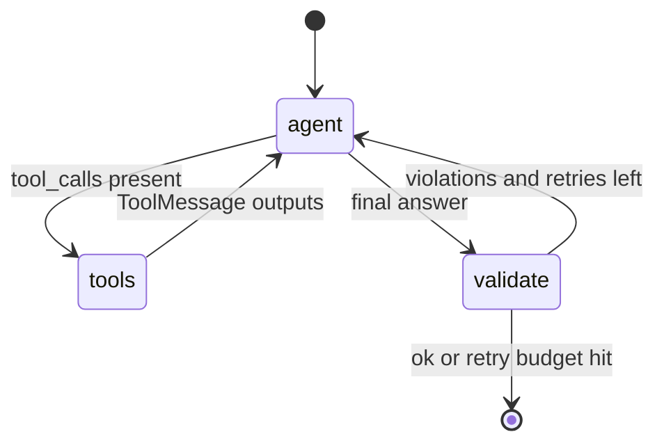

### Knowledge graph schema

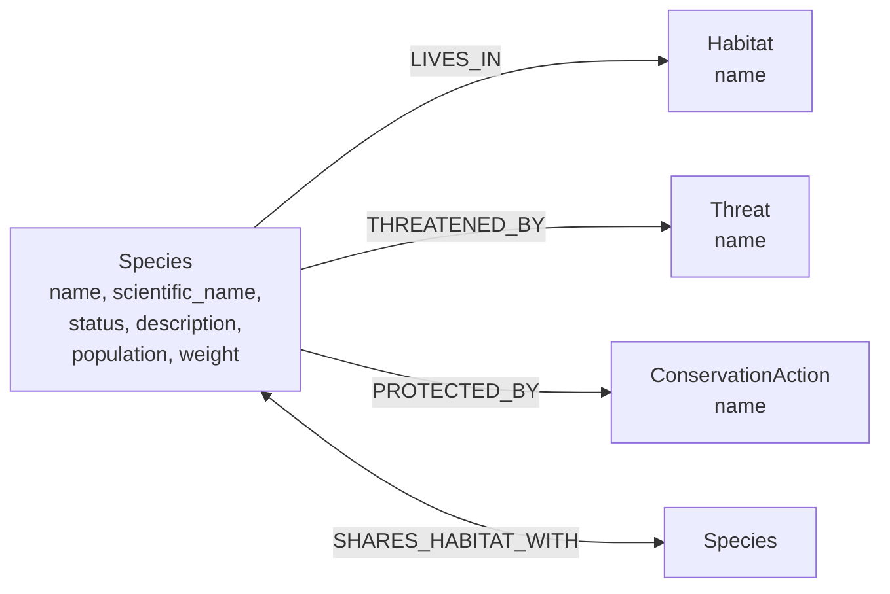

### Tool-call sequence (typical multi-hop request)

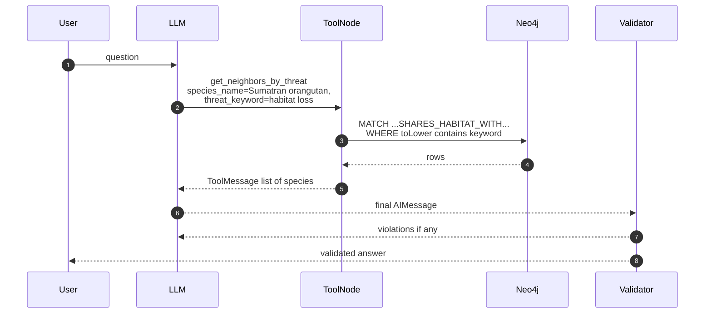

### Evaluation ablation matrix

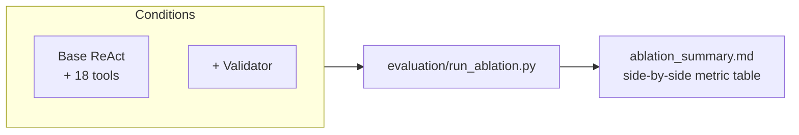

## 2. Components

| File / dir | Role |
|---|---|
| `data/species.json` | Source dataset — 46 endangered species scraped from WWF. |
| `docker-compose.yml` | Neo4j 5.25 community + APOC, healthcheck, mem-tuned. |
| `ingestion.py` | UPSERT species → Neo4j with constraints + bidirectional `SHARES_HABITAT_WITH`. |
| `graphrag_qa.py` | LangGraph ReAct app: `START → agent ↔ tools → [validate] → END`. |
| `evaluation/tool_catalog.py` | 18 parametric Cypher tools; **single source of truth** for the agent and the gold dataset. |
| `evaluation/build_ground_truth.py` | Generates `ground_truth.json` directly from `species.json`. |
| `evaluation/validator.py` | Three-rule grounded-answer validator (pure Python). |
| `evaluation/metrics.py` | Pure-function metric implementations (recall@k, faithfulness, etc.). |
| `evaluation/runner.py` | End-to-end evaluator with two modes: `--gold-tools`, `--with-agent`. |
| `evaluation/run_ablation.py` | Drives the two ablation conditions (base / validator) and emits a comparison table. |
| `check_connectivity.py` | Preflight: env, Neo4j, Ollama, schema, model presence, chat round-trip. |

---

## 3. Installation

### 3.1 Prerequisites

* Python 3.12 (or 3.11+)
* Docker Desktop (for Neo4j)
* [Ollama](https://ollama.com/download) for local LLM inference
* ~4 GB free disk for the LLM weights

### 3.2 Clone and set up the Python env

```cmd
git clone https://github.com/moetzi/agentic-graphrag-endangered-species-qa.git
cd agentic-graphrag-endangered-species-qa

python -m venv .venv
.venv\Scripts\activate
pip install -r requirements.txt
```

### 3.3 Configure environment

Copy the template, then fill in your own Neo4j password:

```cmd
copy .env.example .env
:: edit .env -> NEO4J_PASSWORD = "<your-password>"
```

`docker-compose.yml` reads `NEO4J_USER` and `NEO4J_PASSWORD` from the same
`.env`, so you only configure them in one place.

### 3.4 Pull the LLM

In a separate terminal, leave `ollama serve` running, then pull the model
(default is `llama3.1` — an 8B parameter model that fits 7–9B target):

```cmd
ollama serve
ollama pull llama3.1
```

### 3.5 Start Neo4j

```cmd
docker compose up -d
docker compose ps                    :: wait until "healthy"
```

### 3.6 Verify everything is ready

```cmd
python check_connectivity.py
```

You should see all-PASS (or PASS + a `WARN: graph empty` if you haven't
ingested yet). The script prints actionable error messages if something
isn't running.

---

## 4. Running the pipeline

```cmd
:: 1. Ingest the data into Neo4j
python ingestion.py

:: 2. Generate the ground-truth dataset (if not already in repo)
python -m evaluation.build_ground_truth

:: 3. Sanity check — replay gold tool calls against Neo4j (no LLM)
python -m evaluation.runner --gold-tools

:: 4. Real run — full ReAct agent
python -m evaluation.runner --with-agent

:: 5. (Optional) Ask one question interactively
python graphrag_qa.py "What threats does the Sumatran orangutan face?"
python graphrag_qa.py --validator "Which species share a habitat with the Sumatran orangutan?"

:: 6. (Optional) Run the two-way ablation study (base vs. validator)
python -m evaluation.run_ablation
```

Each runner writes timestamped artefacts under `evaluation/runs/<ts>-<mode>/`:
`results.jsonl`, `summary.json`, `summary.md`. The `runs/` folder is
git-ignored.

---

## 5. Cypher logic and AI pipeline (in brief)

The full discussion is in
[`docs/cypher_and_pipeline.md`](docs/cypher_and_pipeline.md). The short
version:

* The graph is a property graph with four labels (`Species`, `Habitat`,
  `Threat`, `ConservationAction`) and four relationship types (`LIVES_IN`,
  `THREATENED_BY`, `PROTECTED_BY`, `SHARES_HABITAT_WITH`). Every label has
  a `UNIQUE` constraint on `name`, so `MERGE` is idempotent and re-runnable.
* All retrieval is done through 18 **parametric** Cypher templates in
  [`evaluation/tool_catalog.py`](evaluation/tool_catalog.py). Each template
  uses query parameters (`$species_name`, `$threat_keyword`, …) — no string
  interpolation, no Cypher injection risk, easy to evaluate.
* The LangGraph ReAct loop in `graphrag_qa.py` exposes those 18 tools to
  the LLM. The LLM picks a tool per turn, observes the result, and either
  calls another tool or emits a final answer.
* One optional ablation component: a rule-based **validator** that
  checks whether every entity in the answer was actually returned by a
  tool, re-prompting the agent on violation (1-retry cap).

---

## 6. Screenshots (deliverable c, d)

### (a) Database connection — `01_neo4j_connection.png`

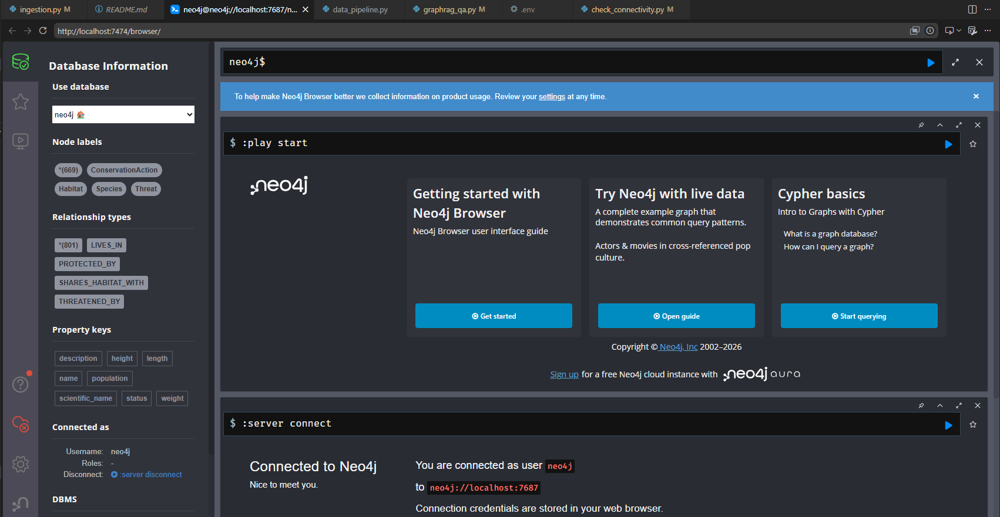

---

### (b) Query / graph builder result

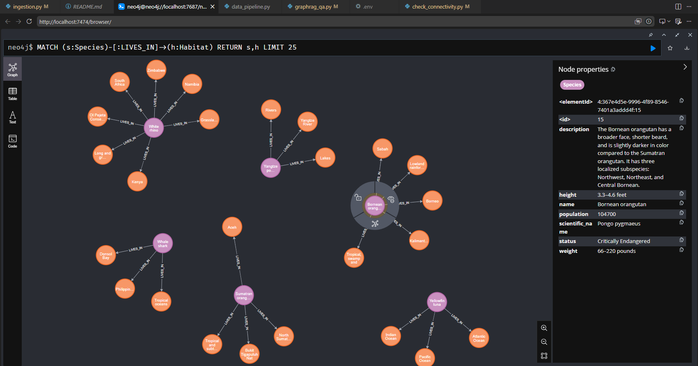

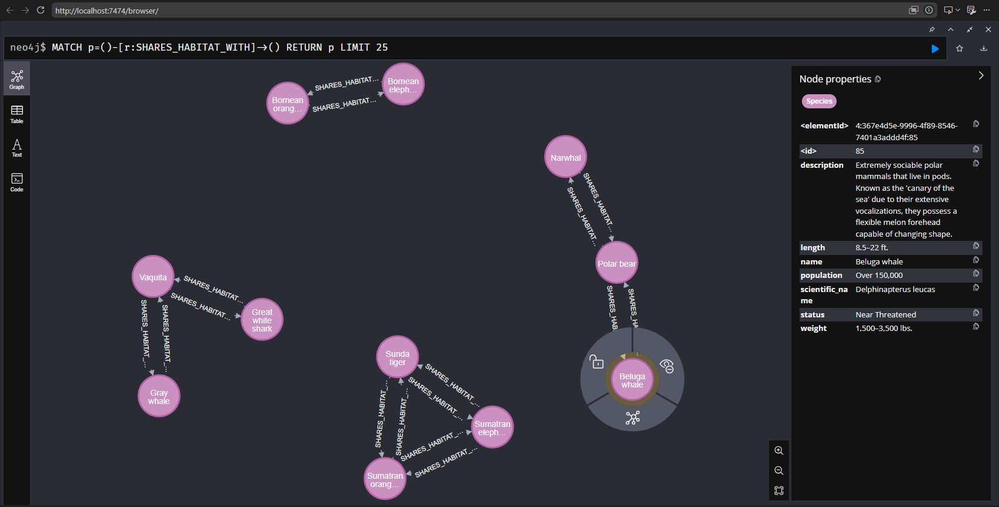

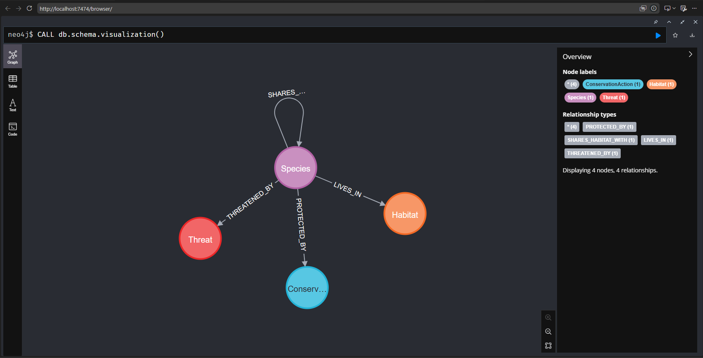

---

### (c) Evaluation / analysis output

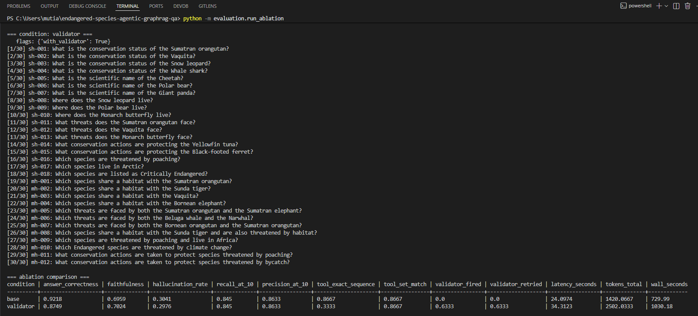

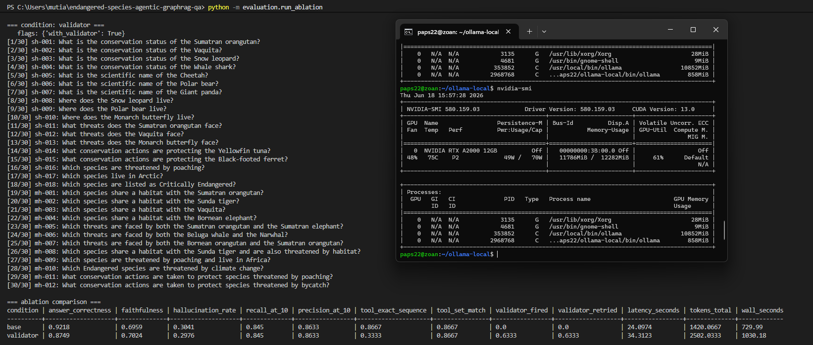

---

### (d) LLM / RAG / Cypher agent demo

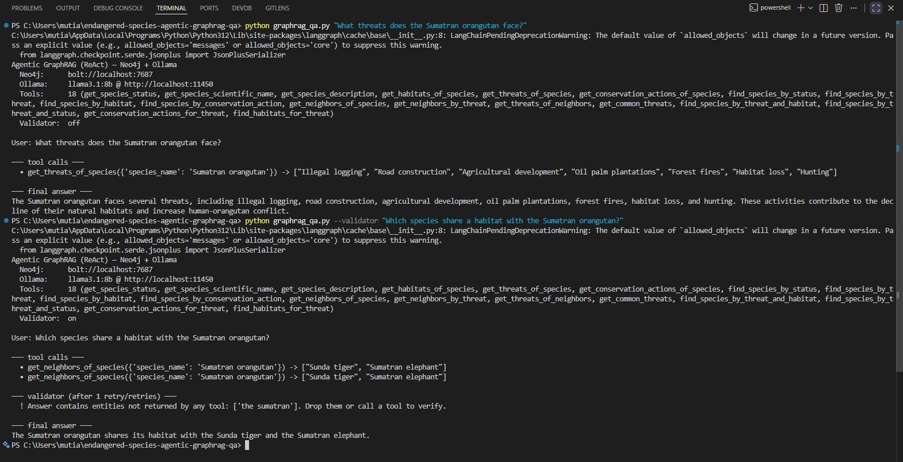

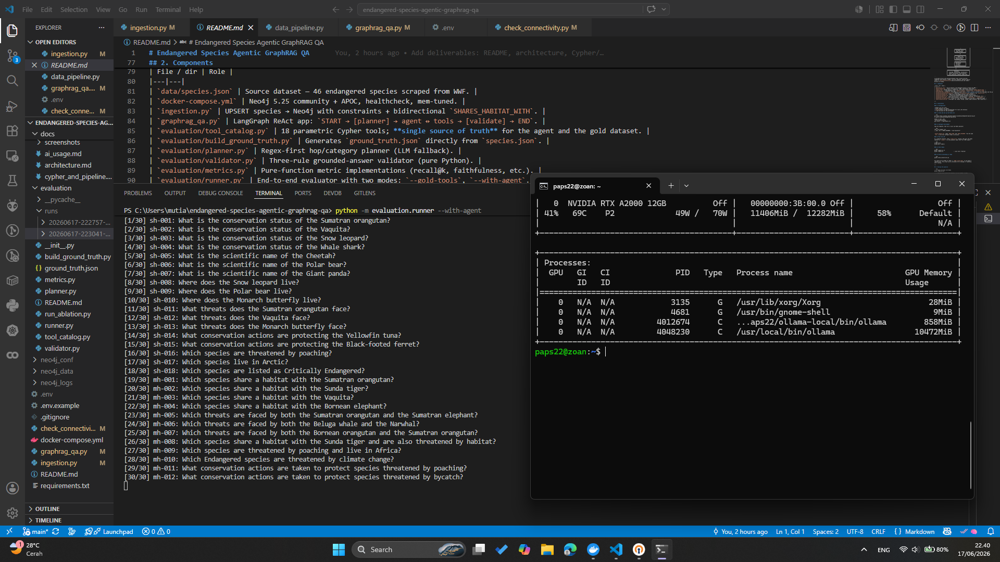

---

## 7. AI usage disclosure

This project was built collaboratively with the **Claude Opus 4.7 (1M
context preview)** assistant inside Kiro IDE. The full prompt log,
model identifier, and a per-file summary of which parts were AI-drafted
vs hand-edited live in [`docs/ai_usage.md`](docs/ai_usage.md), as required
by the assignment.

The headline: AI was used to draft scaffolding, generator code, the metric
implementations, and most of the Cypher templates. Every file was reviewed
and modified by hand. The dataset, design choices (e.g., parametric tools
over text-to-Cypher; rule-based validator instead of an LLM critic), and
all evaluation methodology decisions were made by the author.

---

## 8. Repository conventions

* `.env` is git-ignored. Use `.env.example` as the template.
* Neo4j data and logs (`neo4j_data/`, `neo4j_logs/`, `neo4j_conf/`) are
  git-ignored — they're local Docker volumes.
* Evaluation runs (`evaluation/runs/`) are git-ignored. Only the
  generated `ground_truth.json` is committed.
* `docker-compose.yml` reads credentials from `.env` so there is one
  source of truth for both the DB and Python.

---

## 9. Tech stack

| Layer | Library | Version |
|---|---|---|
| Graph DB | Neo4j Community | 5.25 |
| Graph driver | `neo4j` (Python) | 6.1 |
| LLM | Ollama (`llama3.1` 8B) | latest |
| Agent framework | LangGraph | 1.1 |
| Tool binding | LangChain (`langchain-ollama`, `langchain-community`) | 1.x / 0.4.x |
| Schema validation | Pydantic | 2.12 |
| Container | Docker Compose | latest |

See [`requirements.txt`](requirements.txt) for the exact pins.
