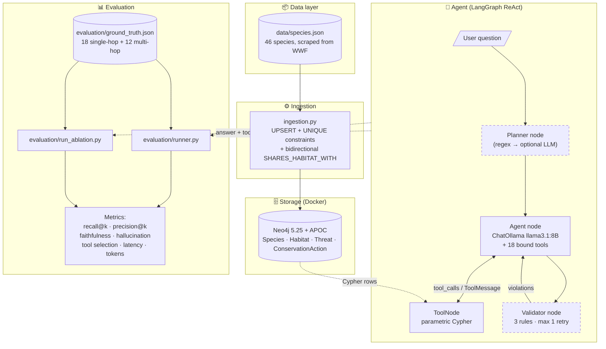
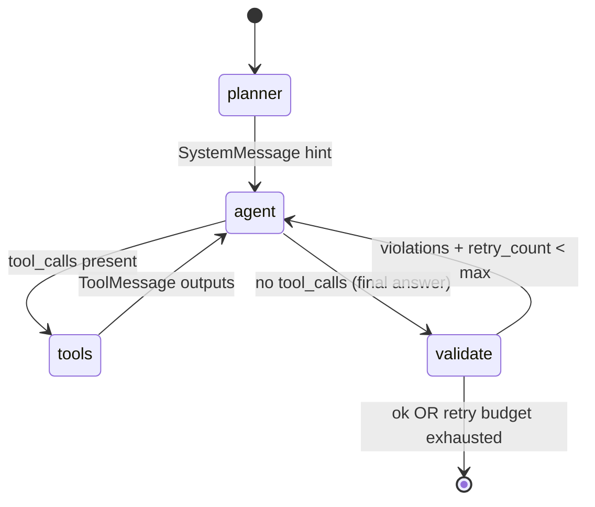
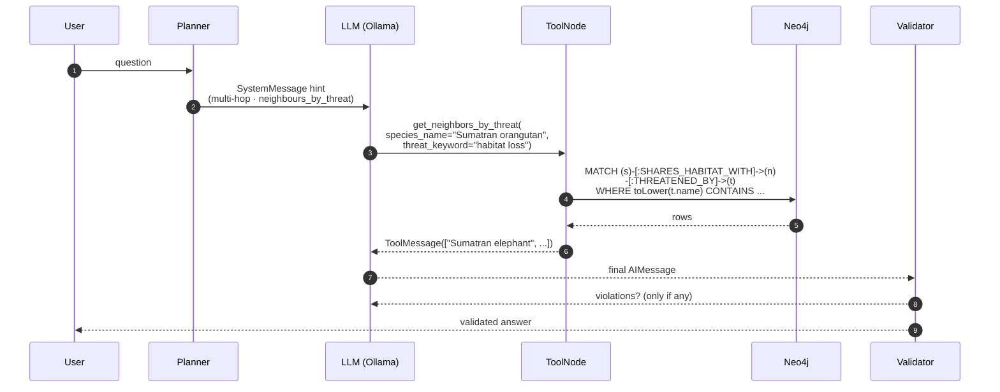
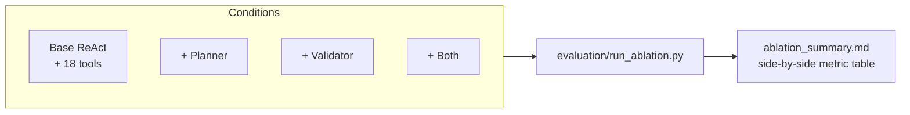

# Architecture diagram

GitHub renders Mermaid blocks natively, so this page stays as a single
source of truth — no separate PNG export needed. Each diagram below is
self-contained and can be edited in place.

## 1. System overview

End-to-end data flow from the WWF source dataset through ingestion,
the agent, and the evaluator.



## 2. LangGraph state machine

Exact compiled topology of `graphrag_qa.build_app(with_planner=True,
with_validator=True)`. Solid edges are unconditional, dashed edges are
conditional, and the dotted self-loop on `agent` is the ReAct
tool-call cycle.



When the planner is disabled the entry edge becomes `[*] --> agent`.
When the validator is disabled the `agent → validate` edge collapses
to `agent → [*]`.

## 3. Knowledge graph schema

The four labels and four relationship types Neo4j stores after
ingestion. Each label has a `UNIQUE` constraint on `name`.

```mermaid
flowchart LR
    S(("Species<br/>name · scientific_name<br/>status · description<br/>population · weight"))
    H(("Habitat<br/>name"))
    T(("Threat<br/>name"))
    A(("ConservationAction<br/>name"))

    S -->|LIVES_IN| H
    S -->|THREATENED_BY| T
    S -->|PROTECTED_BY| A
    S <-->|SHARES_HABITAT_WITH<br/>(bidirectional)| S
```

## 4. Tool-call sequence (typical multi-hop request)

A walkthrough of the question *"Which species share a habitat with the
Sumatran orangutan and are threatened by habitat loss?"*



## 5. Evaluation ablation matrix

The four conditions exercised by `evaluation/run_ablation.py`.



---

## Optional: export to a static image

If you also want a static PNG (e.g., for a slide deck or printed
report), you have three options:

1. **GitHub** renders Mermaid inline already — no export needed for the
   rubric.
2. **Mermaid Live** — paste any of the blocks above into
   <https://mermaid.live/> and `Actions → PNG`.
3. **Mermaid CLI** — `npm install -g @mermaid-js/mermaid-cli` then
   `mmdc -i diagram.mmd -o diagram.png`.

Drop the resulting PNG into `docs/screenshots/architecture.png` if you
prefer a binary deliverable.
